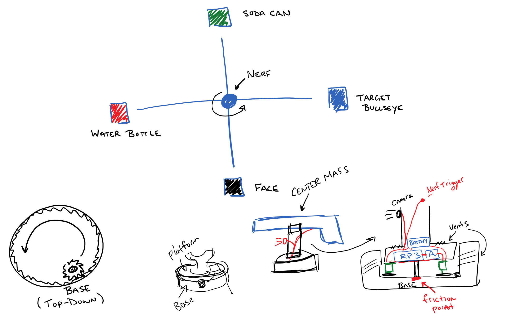

# Intelligent Nerf Turret
Nerf gun turret powered by IoT, machine learning, image recognition, speech to text and natural language processing.

# Logic Flow
1. Capture image
2. Process, recognize and classify image using [Microsoft Custom Vision Service](https://azure.microsoft.com/en-us/services/cognitive-services/custom-vision-service/)
3. Based on classification, target or not target
4. Rotate to capture new object in view

# Design
Below is an outline of our technologies and design consideration. This readme will be built out as we build components.

## Hardware
- [ ] Raspberry Pi 3
- [x] RP Camera
- [x] USB Microphone
- [x] Arduino
- [ ] (2) Servo Motors 
- [ ] Nerf (electric)
- [ ] 3D Printed Base Mount

## Software
- Raspberry Pi 3
  - Arduino (USB Type B) 
    - [Johnny-Five](http://johnny-five.io/)
    - Standard Firmata
  - Raspberry Pi Camera (ribbon cable)
    - Node.js
  - Image Recognition using (on RP3)
    - [Custom Vision Service](https://azure.microsoft.com/en-us/services/cognitive-services/custom-vision-service/)
    - Node.js
  - Nerf (wired)
    - Node.js

## Diagram

